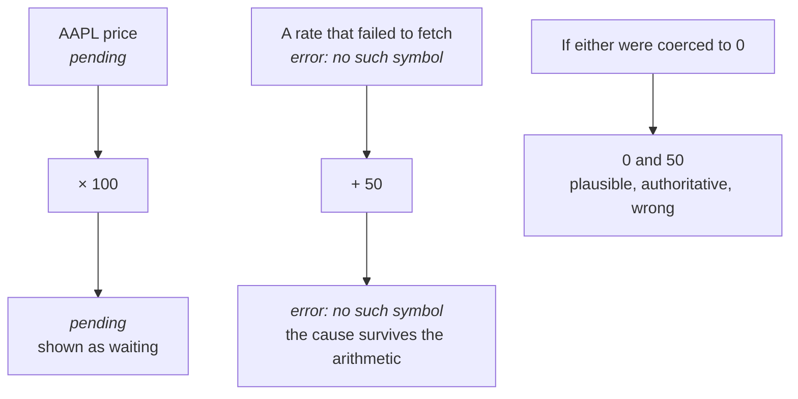

## Bytecode rather than tree walking

Re-evaluating on every keystroke makes interpretation speed the dominant cost.
Compiling once and executing repeatedly is the standard answer, and it also
makes bounding execution straightforward.

## Precedence climbing rather than a generated parser

Adding an operator should be registering a parselet, not regenerating a grammar.
Precedence climbing keeps the extension point small and the parser readable, and
it handles associativity without special cases.

## Normalisation as its own stage

Natural phrasing could have been handled in the parser with lookahead. Making it
a separate token-rewriting stage keeps the parser simple and makes phrase fusion
something a package can contribute declaratively.

It is also what makes prose safety achievable. Words are recognised in context
rather than reserved globally.

## Units are case-sensitive with no aliases

`m` is metres and `M` is a millions suffix. Accepting both cases, or guessing
between plausible aliases, produces confidently wrong answers. Refusing to guess
is the safer default for a tool doing arithmetic on someone's real numbers.

## Errors and pending are values

Both could have been exceptions or nulls. Making them value types means they
propagate through arithmetic and arrive with their cause intact, rather than
being coerced to zero and producing a plausible but wrong result.

## No public holidays in working-day arithmetic

Correct holiday handling needs a region-specific, continuously updated calendar.
Offering an approximation would be worse than not offering it, because the
answer would look authoritative while being wrong for most users.
