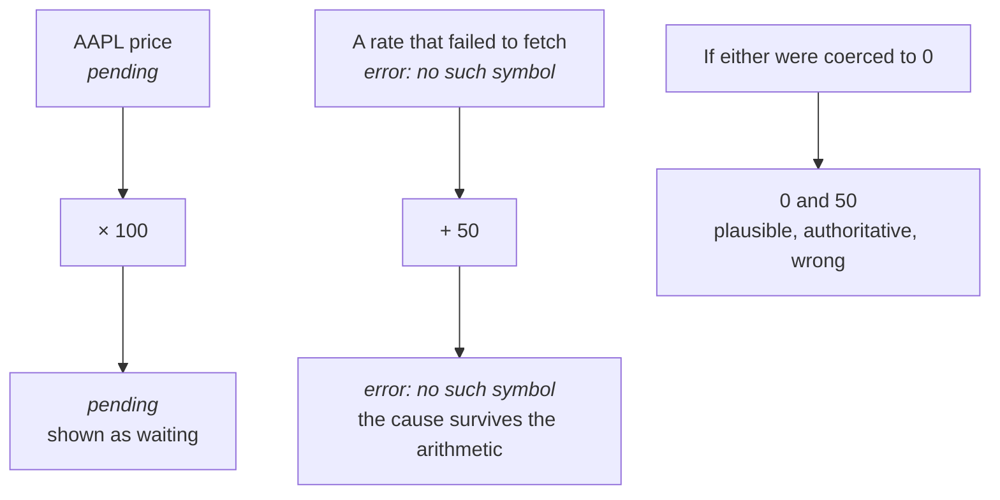

import Explainer from "../../../components/Explainer.tsx";

## Bytecode rather than tree walking

Re-evaluating on every keystroke makes interpretation speed the dominant cost.
Compiling once and executing repeatedly is the standard answer, and it also
makes bounding execution straightforward.

<Explainer id="whyBytecode" client:load />

## Precedence climbing rather than a generated parser

Adding an operator should be registering a parselet, not regenerating a grammar.
Precedence climbing keeps the extension point small and the parser readable, and
it handles associativity without special cases.

## Normalisation as its own stage

Natural phrasing could have been handled in the parser with lookahead. Making it
a separate token-rewriting stage keeps the parser simple and makes phrase fusion
something a package can contribute declaratively.

It is also what makes prose safety achievable. Words are recognised in context
rather than reserved globally.

## Units are case-sensitive and are never remapped

`m` is metres and `M` is a millions suffix. Accepting both cases, or guessing
between plausible aliases, produces confidently wrong answers. Refusing to guess
is the safer default for a tool doing arithmetic on someone's real numbers.

"No aliases" means no remapping: `mt` is not silently read as `t`, and `floz` is
not silently read as a US fluid ounce. It does not mean a unit gets only one
spelling. The conversion table carries several spellings for most units, and all
of them are accepted, so `lb`, `lbs` and `pounds` all work. Those are the unit's
own names, not guesses about what you meant.

The same principle removed an inherited behaviour where `m` was read as minutes
whenever the other side of a conversion was a time unit. It made `today + 5 m`
add five minutes to someone who wrote metres, which is precisely the confidently
wrong answer this rule exists to prevent.

<Explainer id="caseSensitivity" client:load />

## Errors and pending are values

Both could have been exceptions or nulls. Making them value types means they
propagate through arithmetic and arrive with their cause intact, rather than
being coerced to zero and producing a plausible but wrong result.

### A recoverable error carries no stack trace

Because a recoverable error is a value, it does not capture a JavaScript stack
trace. A line of prose in a notepad is not an expression, so parsing it fails,
and that failure is the answer for that line rather than a bug to investigate.

The cost of doing otherwise is not small. Capturing a stack grows more expensive
the deeper the stack is at the time, and the engine reaches the throw about a
dozen frames down inside a document pass. A 250-line document builds one such
error per non-expression line, and a CPU profile put the error constructor at
46% of the whole pipeline, more than lexing, normalising, parsing and executing
together. A prose-heavy document now parses in under a quarter of the time it
used to.

The boundary: an error that is **not** recoverable is a genuine fault and still
captures a full stack. Set `EngineError.captureRecoverableStacks = true` to get
them back for the recoverable ones while debugging.

## No public holidays in working-day arithmetic

Correct holiday handling needs a region-specific, continuously updated calendar.
Offering an approximation would be worse than not offering it, because the
answer would look authoritative while being wrong for most users.
