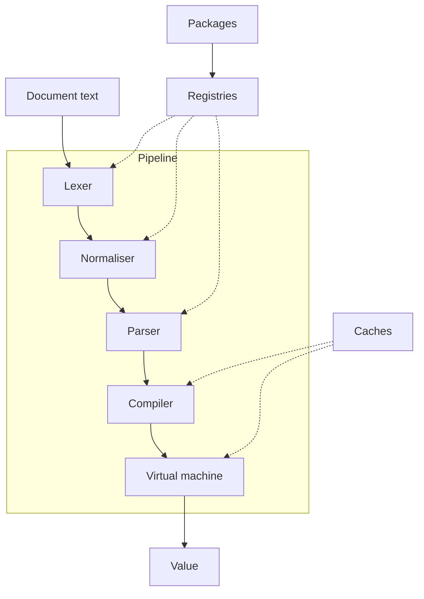
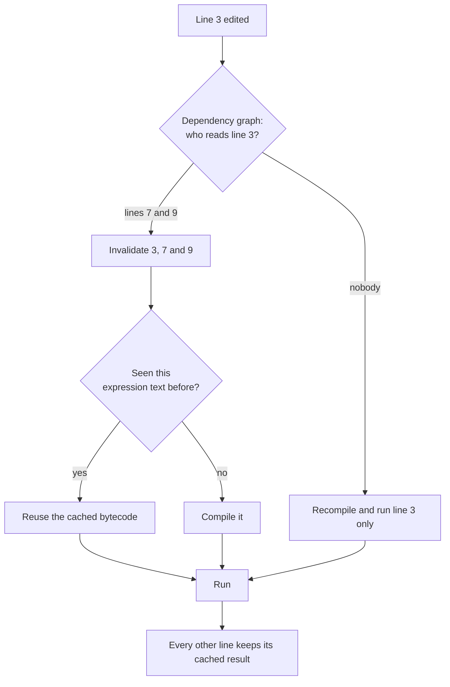

The engine is a pipeline with a plugin system attached to it, plus a caching
layer that makes it viable to run continuously.

## Stages

Text goes through five stages: lexing, normalisation, parsing, compilation, and
execution. Each stage has a single responsibility and hands a well-defined
structure to the next.

The unusual stage is normalisation. It sits between lexing and parsing and
rewrites the token stream, fusing multi-word phrases into single tokens and
making implicit operators explicit. It is what allows natural phrasing without
turning ordinary words into reserved words.

## Values

Execution produces a value: a type, a payload, and sometimes a unit. Errors and
pending states are values too, which means they propagate through arithmetic
instead of being coerced into numbers.

## Packages

Every feature is a package, registered into shared registries at startup. The
pipeline itself knows nothing about percentages, dates or currencies.

## Caching

Three layers. Compiled bytecode is cached by expression text. Line results are
cached by line. A dependency graph tracks which lines depend on which variables,
so an edit recomputes only what it must.

## Further reading

The repository contains a much longer architecture document covering the
bytecode format, the virtual machine's dispatch loop, the safety limits and the
known gaps. It is aimed at contributors rather than users.
