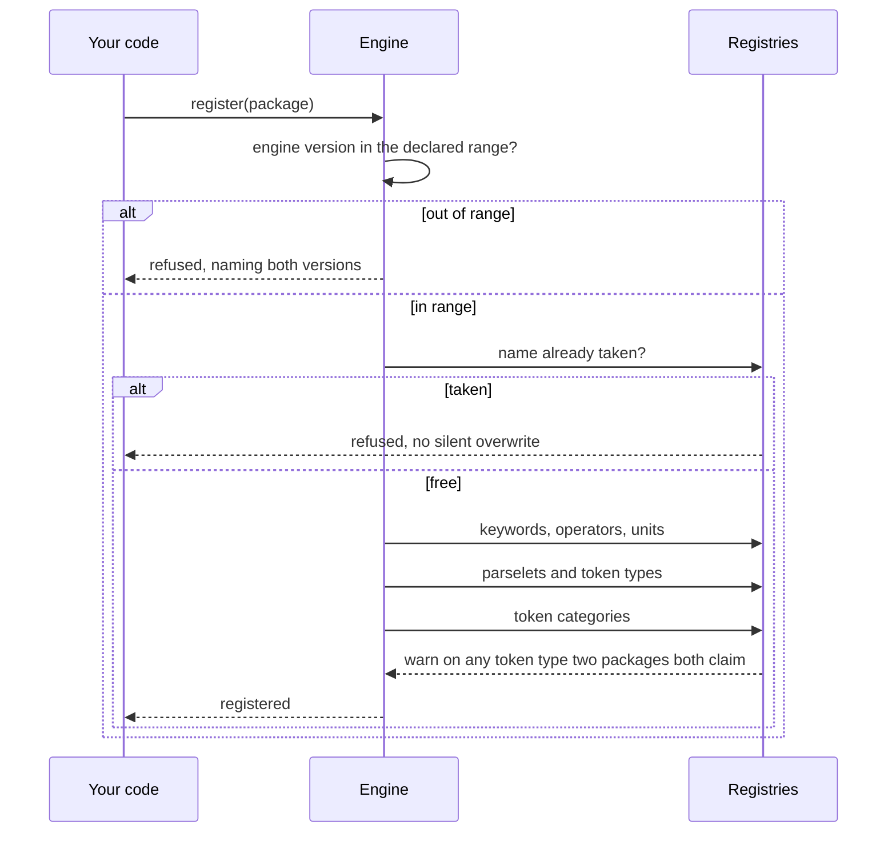

## Registration

A package declares what it contributes and is registered into shared registries.
Registration is ordered, and arithmetic goes first so later packages build on a
working operator set.

Registering a duplicate name is refused, because a silent overwrite would orphan
whatever the first registration contributed.

## Version compatibility

Each package declares the engine version range it was built against. The range
is checked at registration and an incompatible package is refused with a message
naming both versions, rather than failing later in a way that looks like a bug
in the package.

## Collision visibility

Two packages claiming the same token type would silently shadow each other. The
registry warns when that happens, naming both, because the failure is otherwise
extremely hard to diagnose.

## Configuration

A package that needs configuration is exposed as a factory rather than a
constant. This is how the stocks and knowledge packages take a fetching function
without the engine ever holding credentials.
