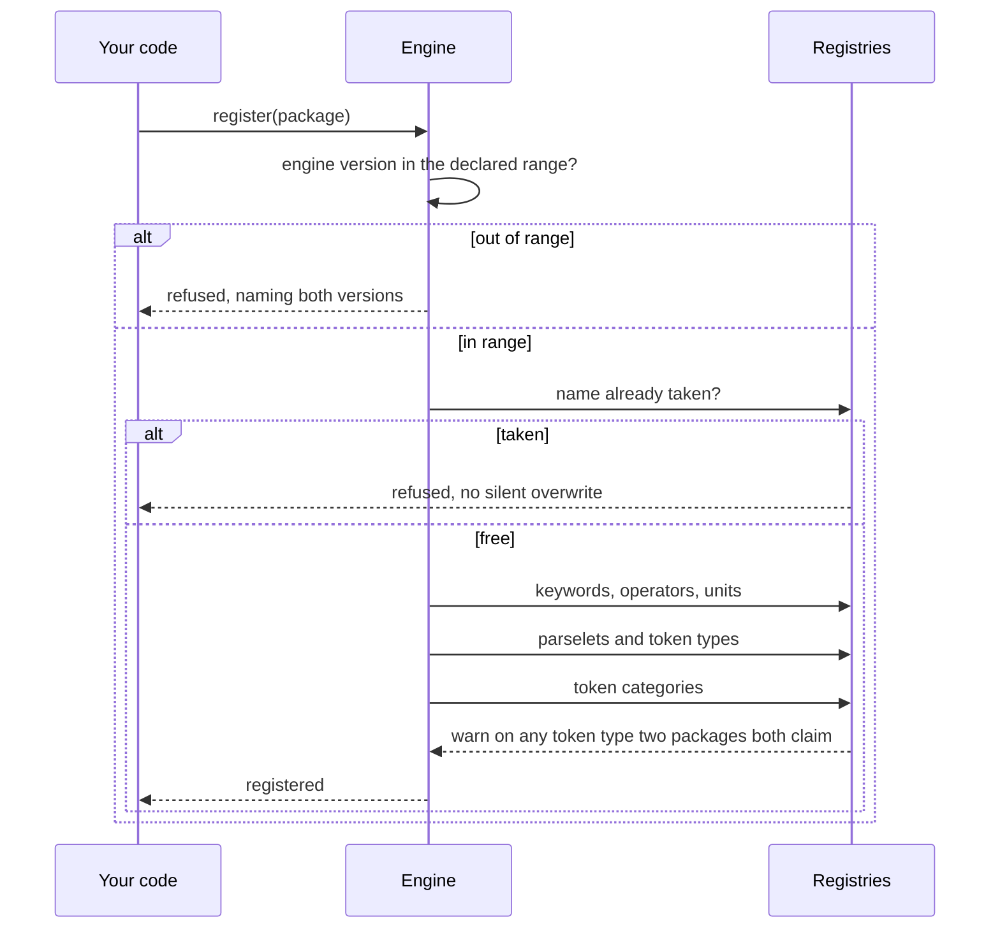

import Explainer from "../../../components/Explainer.tsx";

## Registration

A package declares what it contributes and is registered into shared registries.
Registration is ordered, and arithmetic goes first so later packages build on a
working operator set.

Registering a duplicate name is refused, because a silent overwrite would orphan
whatever the first registration contributed.



Every check that stands between a package and a working engine, in order.

<Explainer id="registration" client:load />

## Version compatibility

Each package declares the engine version range it was built against. The range
is checked at registration and an incompatible package is refused with a message
naming both versions, rather than failing later in a way that looks like a bug
in the package.

## Collision visibility

Two packages claiming the same token type would silently shadow each other. The
registry warns when that happens, naming both, because the failure is otherwise
extremely hard to diagnose.

## Configuration

A package that needs configuration is exposed as a factory rather than a
constant. This is how the stocks and knowledge packages take a fetching function
without the engine ever holding credentials.

## Registering a subset

`BUILTIN_PACKAGES` is an ordinary array, so a host that does not want a
particular package can filter it out.

```ts
const packages = BUILTIN_PACKAGES.filter(p => p.name !== "solve-symbolic");
const engine = new ExpressionEngine({ packages: packages });
```

Do this to change **behaviour**, not to chase speed. Dropping a package removes
the words it claims from the grammar, which matters if your host wants one of
them back as an ordinary name. Without the symbolic package, `factor`, `solve`
and `expand` are just variables again.

It saves very little time. Measured on the symbolic package, the largest of the
built-ins, leaving it out moves engine construction by around 1.3 microseconds
and ordinary line evaluation by about 0.03 microseconds per line. Both are
roughly one percent, which is inside the noise of the measurement. A package
contributes a few registry entries and, at most, one normalizer rule that
declines quickly on tokens it does not claim.

Filtering `BUILTIN_PACKAGES` this way saves no bundle size either, because
importing the array pulls every built-in into your bundle whether you register it
or not. Bundle size is decided by imports, and those are static: to ship less
code, import the packages you want individually (`import { ARITHMETIC_PACKAGE }
from "solve-engine/packages"`) and pass those, so the bundler tree-shakes the rest
away, since nothing in the engine's own module graph references a package you did
not import. `createEngine()` is the opposite trade, every built-in for the
convenience of one call. See the [performance guide](/guide/performance/) for the
parsed-size figures.
