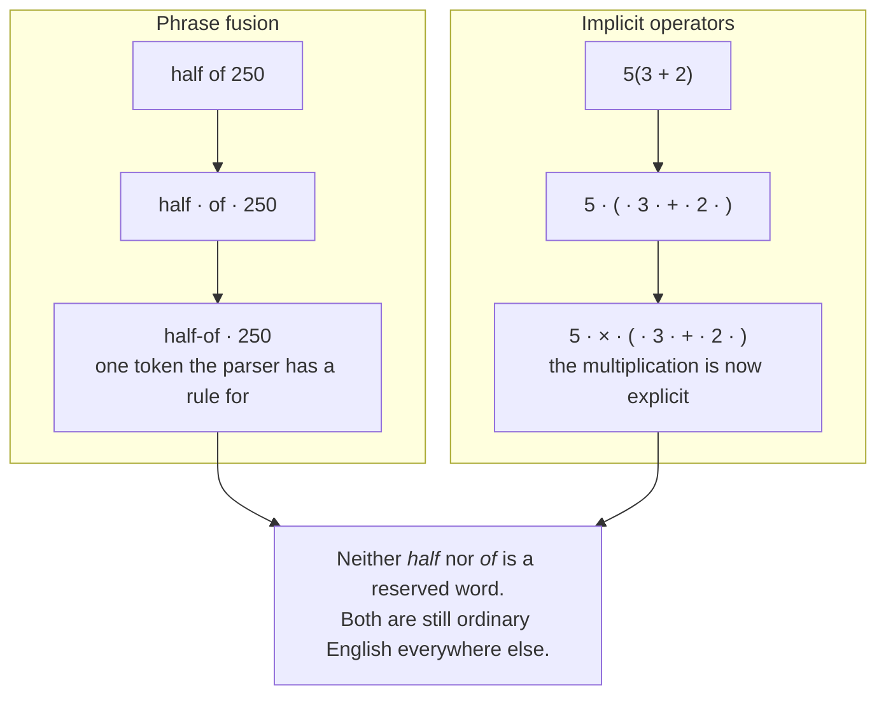

import PipelineWalkthrough from "../../../components/PipelineWalkthrough.tsx";

Each stage is named for what it produces, and what it hands on is a different
shape from what it received. That is the whole reason the stages are separate:
nothing downstream has to know how the text was spelled.

Below, three real expressions walked through all five stages. Every token,
opcode and constant is what the engine actually produced, so if the pipeline
changes and this stops being true, a test fails.

{/* `client:load` rather than `client:visible` because the component gates its
    own autoplay on being in view. Making hydration depend on visibility as
    well only means the controls do nothing for a reader who reaches them
    before the observer has fired. */}
<PipelineWalkthrough client:load />

## Lexing

Characters become tokens. The lexer is vocabulary-driven, so packages add
keywords, operators and units without modifying it.

A token is a type, the text it matched and the span it came from. The span is
what makes syntax highlighting and error positions possible later, so it is
carried even though evaluation never reads it.

## Normalisation

The token stream is rewritten. Two things happen here.

Phrase fusion collapses a sequence of tokens into one. `half of` becomes a single
token that the parser sees as one unit, which is why neither word has to be
reserved.

Implicit operator insertion makes hidden operations explicit, so that `2m`, `50%`
and `5(3 + 2)` parse without special cases in the parser.

This is also what makes prose safety achievable. Words are recognised in
context, at this stage, rather than being reserved globally at the lexer.

## Parsing

Precedence climbing, sometimes called a Pratt parser. Each token type has an
associated parselet and a binding power, and the parser combines them. Adding an
operator is registering a parselet, not editing a grammar.

A parselet is free to emit something other than what the text looks like. The
one registered for `half of` emits a division by two, which is why no stage
after this one has to know the phrase exists.

For speed, the most common token types are handled by an inline fast path ahead
of the registry lookup.

## Compilation

The parse emits bytecode directly rather than building a syntax tree first. The
result is a compact program plus constant pools for numbers and strings.

Order of evaluation moves out of the structure and into the order of the
instructions. Parentheses have no representation in the compiled program at all,
because by then they have done their job.

## What each stage costs

Measured with a CPU profile over a 250-line document of mixed prose, arithmetic,
units, dates and cross-line references, which is the shape a real notepad has.

| stage | share |
| --- | --- |
| Normalisation | 19% |
| Execution and orchestration | 20% |
| Lexing and line scanning | 14% |
| Parsing and compiling | 12% |
| Everything else | the remainder |

No single stage dominates, which is the point of listing them: the cheapest way
to make the engine slower is to assume one of them is free. Two things that used
to dominate no longer appear. Errors were the larger, at 46% of the pipeline
before recoverable ones stopped capturing stack traces (see
[Errors and pending are values](/architecture/design-decisions/#errors-and-pending-are-values)).
Number literals were the other: parsing `144` used to run six prefix checks, two
regular expressions and a locale lookup before reaching an answer a single
character scan gives.

Rule matching in normalisation is bounded the same way. A rule declares the
shape it can match, the normalizer intersects those declarations, and a position
where nothing can fire is rejected without calling a rule at all. See
[Recognising phrases and words](/packages/recognising-phrases/) for how a package
declares one.

## Execution

A stack virtual machine runs the bytecode. The dispatch loop bounds instruction
count and stack depth on every instruction, so a pathological expression fails
with a clear error instead of hanging.

The stack holds values rather than numbers. A unit, an error or a pending state
survives an operation instead of being flattened, which is what lets a result
arrive with its cause intact rather than as a plausible zero.
